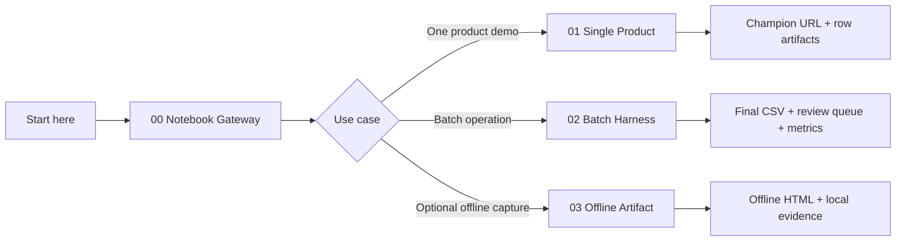
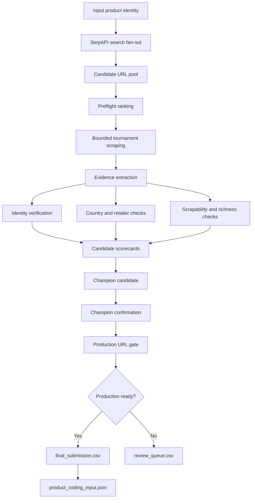
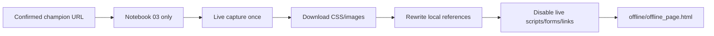

# Product Evidence Harness

## Executive positioning

The Product Evidence Harness is an enterprise-grade system for turning product web search into **verified, auditable, product-coding-ready evidence**.

It is not a simple scraper. It is not a loose search utility. It is a controlled evidence pipeline that discovers candidate product URLs, validates them, confirms a champion, and writes business-ready outputs plus audit artifacts.

```text
Input product identity -> verified product URL evidence -> production handoff -> product coding evidence
```

## Start with notebooks

The notebooks are the gateway into the system. Users should start here, not inside `src/`.

| Notebook | Use when | Business outcome |
|---|---|---|
| `notebooks/00_notebook_gateway.ipynb` | You are new to the repo. | Understand which notebook to use and how the system works. |
| `notebooks/01_single_product_harness.ipynb` | You want to prove the full system on one product. | Champion URL, confirmation, production gate, row artifacts. |
| `notebooks/02_batch_product_harness.ipynb` | You want to run many products. | Final CSV, review queue, metrics, row artifacts. |
| `notebooks/03_offline_product_artifact.ipynb` | You already have a confirmed champion URL and need offline evidence. | Local `offline_page.html`, local assets, validation JSON. |



## Business value

| Problem today | Harness value |
|---|---|
| Manual product URL search is inconsistent. | Candidate tournament and evidence-based selection. |
| Search rank is treated as truth. | Search is only a candidate source, not final proof. |
| Wrong variants/listings can slip through. | Identity, EAN, title, quantity, and variant checks. |
| Scraping issues are discovered too late. | Scrapability and browser-readiness are checked before handoff. |
| Decisions are hard to defend. | Markdown, JSON, CSV, and metrics artifacts explain the decision. |
| Automation hides uncertainty. | Weak cases go to review queue with failure taxonomy. |

## Primary architecture



The older iterative loop is retained only as a legacy/debug fallback when tournament mode is explicitly disabled.

## High-stakes handoff policy

`product_url`, `production_url_ready`, and champion confirmation must not be confused.

```text
product_url = selected/champion URL emitted by the harness
production_url_ready = whether product_url is safe for browser-opening, downstream scraping, and product coding
champion_confirmation.passed = whether repeated champion confirmation passed
```

Use automated handoff only when:

```text
production_url_ready = true
production_url_status = PRODUCTION_READY_EXACT_SCRAPABLE_BROWSER_URL
champion_confirmation.passed = true
champion_confirmation.success_count = champion_confirmation.required_successes
needs_review = false
```

Rows outside this filter are review-only, even when a useful fallback URL exists.

## Tournament defaults

Tournament mode is the default.

```env
PRODUCT_HARNESS_ENABLE_TOURNAMENT_MODE=true
PRODUCT_HARNESS_TOURNAMENT_MAX_SERP_CREDITS=4
PRODUCT_HARNESS_TOURNAMENT_CANDIDATE_POOL=150
PRODUCT_HARNESS_TOURNAMENT_PREFLIGHT_TOP_K=60
PRODUCT_HARNESS_TOURNAMENT_BATCH_SIZE=20
PRODUCT_HARNESS_TOURNAMENT_MAX_BATCHES=3
```

The code clamps `PRODUCT_HARNESS_TOURNAMENT_MAX_SERP_CREDITS` to a maximum of `4`.

Tournament scrape volume is bounded by:

```text
preflight candidates considered = top PRODUCT_HARNESS_TOURNAMENT_PREFLIGHT_TOP_K ranked candidates
max tournament batch candidates scraped = PRODUCT_HARNESS_TOURNAMENT_BATCH_SIZE × PRODUCT_HARNESS_TOURNAMENT_MAX_BATCHES
default max tournament batch candidates scraped = 20 × 3 = 60
```

Champion confirmation is a fixed post-selection quality gate:

```text
champion_confirmation.required_attempts = 3
champion_confirmation.required_successes = 3
```

These checks are not extra SerpAPI searches. They are post-selection confirmations recorded in row artifacts.

## Input contract

| Field | Required | Role |
|---|---:|---|
| `row_id` | Recommended | Stable product/row identifier. |
| `main_text` | Yes | Primary product identity text. |
| `country_code` | Yes | Country-first search market. |
| `ean` / `gtin` | No | Strong user-provided identity anchor. Must remain a string. |
| `retailer_name` | No | Preferred first evidence source, not always a hard final constraint. |
| `language_code` | No | Optional search language override. |
| `region` | No | Optional market hint. |

EAN/GTIN identifiers are read as strings. Invalid/corrupted values are retained for diagnostics but are not used as exact search anchors.

## Output contract

```text
CSV = final operational answer
Markdown = readable evidence and decision trace
JSON = machine-readable replay/debug/product-coding evidence
Notebook = user-facing execution gateway
```

### Batch-level outputs

```text
outputs/
├── final_submission.csv
├── review_queue.csv
├── batch_summary.md
└── metrics.json
```

### Row-level artifact packet

```text
output/<row_id>/
├── final_row.csv
├── report.md
├── search_plan.md
├── candidate_review.md
├── scrape_evidence.md
├── retailer_scrapability.md
├── final_decision.md
├── decision_trace.md
├── trace.json
├── enterprise_assessment.json
├── evidence_graph.json
├── product_coding_input.json
├── review_feedback_template.json
├── quality_assessment.md
├── tournament_bracket.json
├── tournament_bracket.md
├── champion_confirmation.json
├── champion_confirmation.md
└── batch_winners.csv
```

## Optional offline artifact

Offline page freezing is optional and separate from the main discovery workflow.



Use it only through:

```text
notebooks/03_offline_product_artifact.ipynb
```

It is intentionally not part of `main.py`, `batch_main.py`, or notebooks `01`/`02`.

## Documentation map

| Document | Purpose |
|---|---|
| `docs/BUSINESS_OVERVIEW.md` | Leadership/business value explanation. |
| `docs/NOTEBOOK_GATEWAY.md` | Notebook-first user journey. |
| `docs/VISUAL_PIPELINE_GUIDE.md` | Graphical architecture and non-linear flow. |
| `docs/DECISION_CONTRACTS.md` | Meaning of output fields/statuses. |
| `docs/ARTIFACT_GUIDE.md` | Output files, row artifacts, and audit trail. |
| `docs/ASSUMPTIONS_AND_CONSTRAINTS.md` | Explicit assumptions, limits, and risk boundaries. |
| `docs/ADOPTION_PLAYBOOK.md` | How to demo, roll out, and standardize the repo. |
| `docs/OFFLINE_PRODUCT_ARTIFACT.md` | Optional offline capture contract. |

## Minimal single-product usage

```python
from product_evidence_harness import HarnessConfig, ProductEvidenceHarness, ProductQuery, SerpAPIConfig, ProductionURLGate

product = ProductQuery(
    row_id="CO-ML-0001",
    main_text="PUT PRODUCT TEXT HERE",
    country_code="CO",
    ean="",
    retailer_name="Mercado Libre",
)

config = HarnessConfig.from_env(".env")
serp_config = SerpAPIConfig.from_env(country_code=product.country_code, language_code="es")
harness = ProductEvidenceHarness(serp_config=serp_config, config=config)
trace = harness.run(product, return_trace=True)

match = trace.best_match
tournament = getattr(trace.state, "tournament_result", None)
confirmation = getattr(tournament, "champion_confirmation", None) if tournament else None
production = ProductionURLGate().assess_url_in_state(trace.state, match.product_url or "")

print(match.product_url)
print(production.to_dict() if production else "No production assessment")
print(confirmation.to_dict() if confirmation else "No champion confirmation")
```

## Batch usage

```bash
python batch_main.py \
  --input data/products.xlsx \
  --output outputs/final_submission.csv \
  --workers 4
```

## Validation

```bash
PYTHONPATH=src python -m compileall -q src main.py batch_main.py
PYTHONPATH=src pytest -q
```

## Import path note

This project uses a standard `src/` package layout. In notebooks, add `<repo>/src` to `sys.path`, then import with `product_evidence_harness`. Do not import with `src.product_evidence_harness`. See `docs/IMPORT_PATH_FIX.md`.
