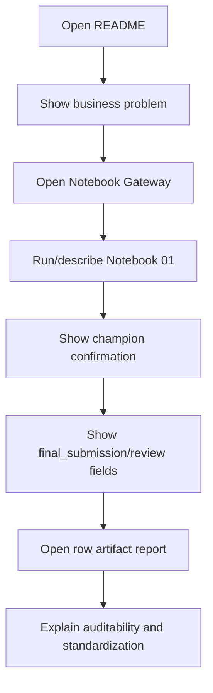
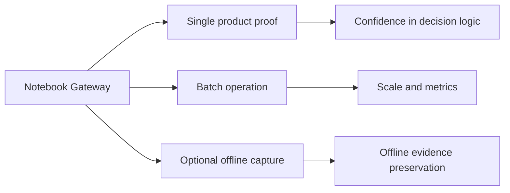

# Adoption Playbook

This playbook explains how to present, demo, and standardize the Product Evidence Harness.

## Adoption message

```text
This repo turns product web search into auditable product evidence.
It gives the business a standard way to find, verify, explain, and hand off product URLs for downstream coding.
```

## Who should use it

| User group | Primary entrypoint | Outcome |
|---|---|---|
| Leadership | `docs/BUSINESS_OVERVIEW.md` | Understand business value and standardization case. |
| Managers | `docs/NOTEBOOK_GATEWAY.md` | Know which notebook proves which capability. |
| Analysts | `notebooks/01_single_product_harness.ipynb` | Run and inspect one product. |
| Operations | `notebooks/02_batch_product_harness.ipynb` | Run many products and review outputs. |
| Audit/evidence users | `notebooks/03_offline_product_artifact.ipynb` | Freeze a confirmed page offline when needed. |
| Engineers | `docs/VISUAL_PIPELINE_GUIDE.md` | Understand pipeline internals and extension points. |

## 10-minute leadership demo



Demo script:

```text
1. This is not a scraper; it is a product evidence harness.
2. The system does not blindly trust search rank.
3. It evaluates candidates through scraping, identity, country, retailer, and quality checks.
4. It confirms a champion before production handoff.
5. Weak cases are routed to review instead of being falsely automated.
6. Every decision has an artifact trail.
7. The notebooks make adoption easy across users.
```

## Standard operating model



## Rollout plan

| Phase | Goal | Action |
|---|---|---|
| Phase 1 | Awareness | Share README + Business Overview. |
| Phase 2 | Demo | Walk leadership through Notebook 01. |
| Phase 3 | Batch pilot | Run Notebook 02 on a controlled input file. |
| Phase 4 | Review process | Use review queue and failure taxonomy. |
| Phase 5 | Standardization | Make production handoff gates mandatory. |
| Phase 6 | Optional audit layer | Use Notebook 03 for offline evidence where required. |

## What to standardize

```text
Input contract: main_text + country_code required.
Champion handoff: production_url_ready=true and needs_review=false and champion_confirmation.passed=true.
Review process: anything below production-ready goes to review queue.
Artifact retention: row artifacts are part of the decision record.
Notebook-first usage: users start from notebooks, not internal modules.
```

## What not to standardize

```text
Do not standardize manual link picking.
Do not standardize first-search-result selection.
Do not standardize URLs without scrape evidence.
Do not standardize review-only URLs as automation-ready.
Do not make optional offline capture mandatory for every row.
```

## Leadership value statement

```text
The Product Evidence Harness creates a governed product URL evidence layer.
It improves speed, consistency, explainability, downstream readiness, and auditability.
```

## Adoption success criteria

| Metric | Target behavior |
|---|---|
| Notebook usage | Users begin with Notebook Gateway or Notebook 01/02. |
| Production handoff quality | Only confirmed champions are automated. |
| Review queue quality | Weak rows have clear failure taxonomy. |
| Artifact usage | Managers can inspect why a URL won. |
| Reusability | Product coding consumes structured evidence, not ad hoc links. |

## Final positioning

```text
A search tool gives links.
A scraper gives page text.
This harness gives verified product evidence.
```
