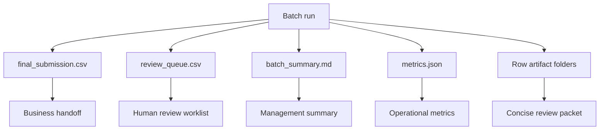
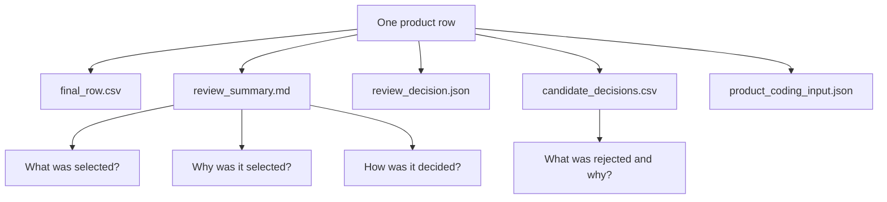
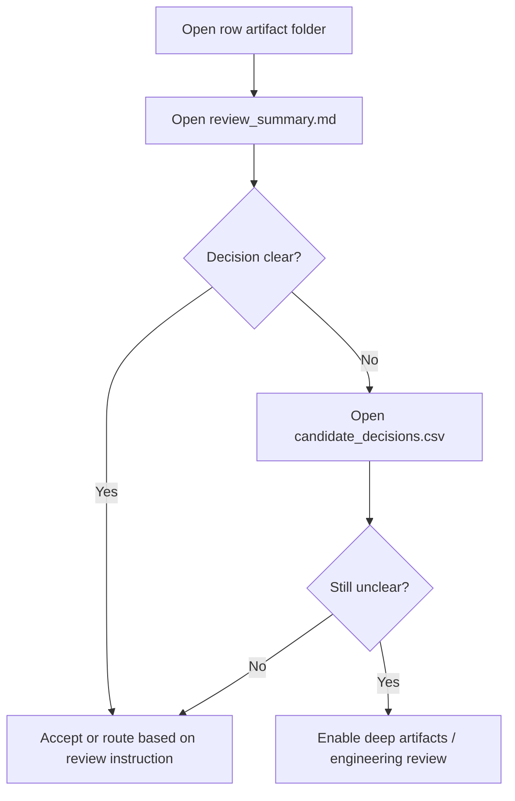
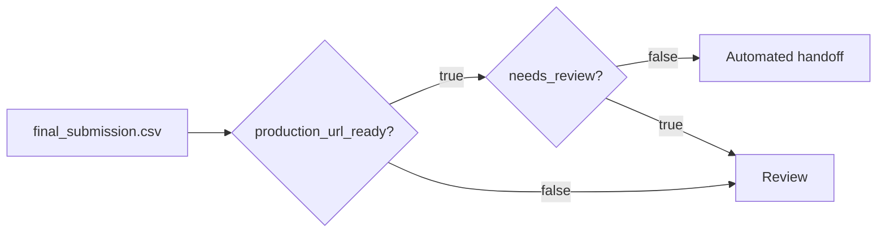
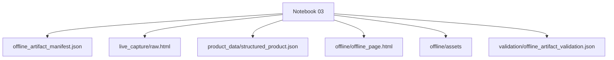

# Artifact Guide

The harness writes business outputs and audit artifacts. The default artifact layout is now **reviewer-first**: fewer files, sharper decisions, less context distraction.

## Artifact philosophy

```text
Default output = concise, reviewable decision packet
Deep output = opt-in engineering/debug trace
```

| Format | Default role |
|---|---|
| CSV | Operational row/batch output and candidate accept/reject table. |
| Markdown | Human-readable decision summary. |
| JSON | Compact machine-readable decision/product-coding payload. |
| Notebook | User-facing execution gateway. |

## Batch-level artifact map



## Default row-level artifact map



## Default row folder

```text
output/<row_id>/
├── final_row.csv
├── review_summary.md
├── review_decision.json
├── candidate_decisions.csv
└── product_coding_input.json
```

## Key business artifacts

| Artifact | Audience | Purpose | Open first? |
|---|---|---|---:|
| `review_summary.md` | Reviewers, managers, analysts | Concise what/why/how decision summary. | Yes |
| `candidate_decisions.csv` | Reviewers | Top candidates with selected/rejected reasons. | Yes |
| `final_row.csv` | Business/operations | One-row operational output. | Sometimes |
| `product_coding_input.json` | Product coding engine | Structured evidence for downstream coding. | No |
| `review_decision.json` | Notebook/UI/automation | Compact machine-readable version of the review summary. | No |

## Review workflow



## Final submission interpretation



Automated handoff requires:

```text
production_url_ready = true
needs_review = false
champion_confirmation.passed = true
```

## Product coding handoff

The downstream product coding system should consume:

```text
output/<row_id>/product_coding_input.json
```

It contains the structured evidence package:

```text
selected_url
verified_exact_url
supporting_urls
selected_page_evidence
brand/manufacturer/description/specs/images/EAN evidence
identity_verification
quality_tier
coding_readiness_status
review_flags
```

## Optional deep artifacts

Deep artifacts are available only when explicitly enabled:

```env
PRODUCT_HARNESS_WRITE_MARKDOWN_REPORTS=true
PRODUCT_HARNESS_WRITE_TRACE_JSON=true
PRODUCT_HARNESS_WRITE_DEBUG_CSVS=true
```

Use deep artifacts only when:

```text
review_summary.md is insufficient
candidate scoring needs debugging
scrape behavior needs investigation
LLM/model calls need audit inspection
engineering needs replay/debug traces
```

## Optional offline artifact

Offline artifacts are not created by default. They are created only through:

```text
notebooks/03_offline_product_artifact.ipynb
```

Optional offline artifact map:



Use offline artifacts only when the workflow explicitly requires offline reproducibility or manual inspection.

## Reviewer rule

```text
A reviewer should be able to judge most rows from review_summary.md and candidate_decisions.csv only.
```
