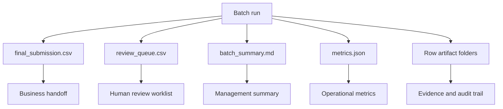
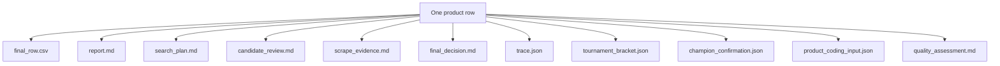
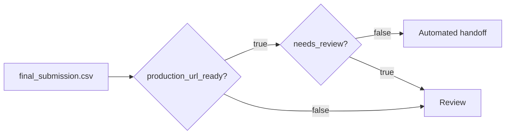
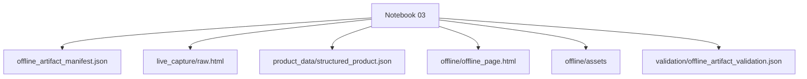
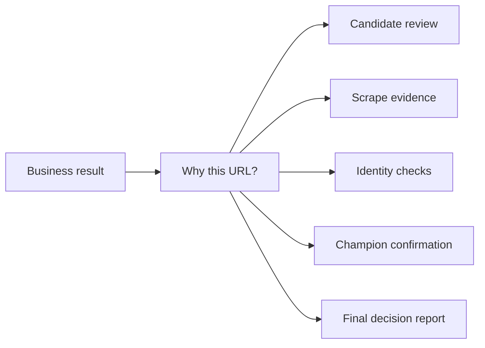

# Artifact Guide

The harness writes business outputs and audit artifacts. This document explains what each artifact is for and how users should interpret it.

## Artifact philosophy

```text
CSV = operational business output
Markdown = human-readable decision story
JSON = machine-readable audit/replay evidence
Notebook = user-facing execution gateway
```

## Batch-level artifact map



## Row-level artifact map



## Key business artifacts

| Artifact | Audience | Purpose |
|---|---|---|
| `final_submission.csv` | Business/operations | Main output table for production handoff. |
| `review_queue.csv` | Review team | Rows that should not be automated yet. |
| `batch_summary.md` | Manager/leadership | Human-readable batch-level summary. |
| `metrics.json` | Engineering/ops | Machine-readable performance and quality metrics. |
| `output/<row_id>/report.md` | Everyone | Row-level story explaining what happened. |
| `output/<row_id>/trace.json` | Engineering/audit | Machine-readable replay/debug trace. |
| `output/<row_id>/product_coding_input.json` | Product coding engine | Structured evidence for downstream coding. |
| `output/<row_id>/champion_confirmation.json` | Audit/reviewer | Repeated champion confirmation result. |
| `output/<row_id>/tournament_bracket.json` | Engineering/reviewer | Candidate tournament details. |

## Final submission interpretation



Automated handoff requires:

```text
production_url_ready = true
needs_review = false
champion_confirmation.passed = true
```

## Product coding handoff

The downstream product coding system should consume:

```text
output/<row_id>/product_coding_input.json
```

It contains the structured evidence package:

```text
selected_url
verified_exact_url
supporting_urls
selected_page_evidence
brand/manufacturer/description/specs/images/EAN evidence
identity_verification
quality_tier
coding_readiness_status
review_flags
```

## Optional offline artifact

Offline artifacts are not created by default. They are created only through:

```text
notebooks/03_offline_product_artifact.ipynb
```

Optional offline artifact map:



Use offline artifacts only when the workflow explicitly requires offline reproducibility or manual inspection.

## Audit trail value

The artifact system makes the repo enterprise-ready because every decision can be inspected after the run.


