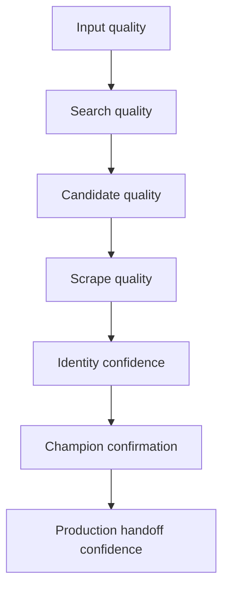
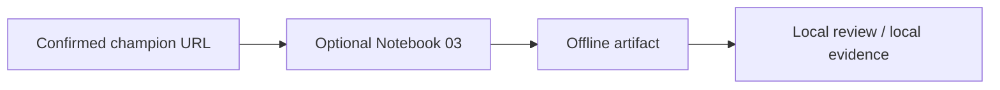
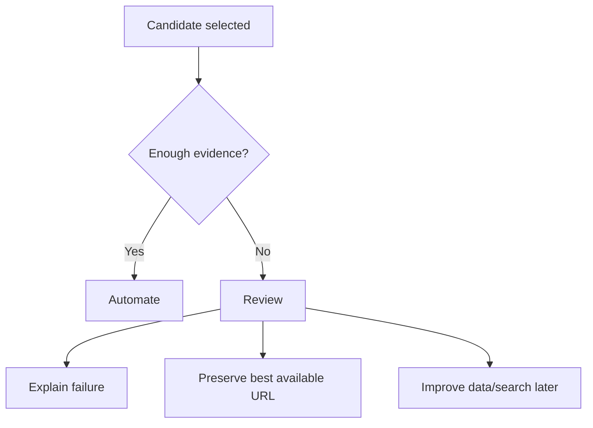

# Assumptions and Constraints

This document makes the operating assumptions explicit. This is important for leadership trust and for correct usage by analysts, operations, and downstream teams.

## Input assumptions

| Input | Required | Assumption |
|---|---:|---|
| `main_text` | Yes | Primary product identity text must be meaningful. |
| `country_code` | Yes | Country is required because search and validation are country-sensitive. |
| `ean` / `gtin` | No | Strong identity anchor when available; must be treated as a string. |
| `retailer_name` | No | Preferred evidence source, not always a guaranteed final URL source. |
| `row_id` | Recommended | Stable id for artifact organization and audit. |

## Key constraints

```text
SerpAPI search credits are capped.
Search results are not ground truth.
Retailer pages can change.
Scraping can fail.
EAN values can be corrupted by Excel if stored as numbers.
Country and retailer availability may vary by product.
A confirmed champion is strong runtime evidence, not a permanent guarantee forever.
```

## Reliability model



The harness improves reliability by collecting and validating evidence, but it cannot control external retailer behavior.

## Champion guarantee

A confirmed champion means:

```text
The URL passed the harness production-readiness checks at run time.
```

It does not mean:

```text
The retailer page will remain available forever.
The page can never change.
The site can never block future scraping.
```

## Country and fallback assumptions

The system is country-aware. Depending on policy, it may identify:

```text
requested retailer candidate
same-country candidate
alternative/global fallback candidate
review-only candidate
```

Business policy decides whether fallback candidates are acceptable for automated handoff.

## Optional offline capture assumptions

Offline capture is separate from the main discovery flow.



Important constraints:

```text
Offline capture starts after champion confirmation.
It does not discover product URLs.
It does not replace the main tournament flow.
It may still fail if the first live page capture is blocked.
```

## Review queue assumption

The review queue is part of the quality design.

```text
Weak evidence should not be hidden.
Weak evidence should be routed to review.
```

## Operational discipline

Do not bypass these gates for automated handoff:

```text
production_url_ready = true
needs_review = false
champion_confirmation.passed = true
```

## Decision safety



The system is designed to be aggressive in discovery but conservative in automated handoff.
