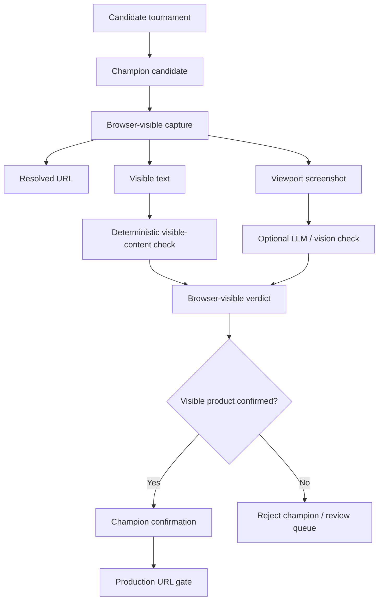

# Browser-visible Product Content Gate

This document defines the new champion-quality gate that verifies what a normal browser user actually sees.

## Why this exists

A URL can be technically browser-openable and still be unsafe for production handoff.

Examples:

```text
- homepage reroute
- category page
- search results page
- consent wall
- login wall
- anti-bot / access denied page
- wrong product page
- marketplace shell without product details
- geo/session reroute that hides the actual product
```

Therefore:

```text
browser_openable = true
```

does not automatically mean:

```text
user sees the intended product
```

## New principle

```text
A champion URL is valid only if:
1. It opens in a browser
2. The browser-visible page is a genuine product page
3. The visible content matches the intended product
4. The page is not visibly rerouted, blocked, or substituted
```

## Pipeline placement



## Signals used

| Signal | Purpose |
|---|---|
| Final resolved URL | Detect redirect/reroute/substitution. |
| Browser screenshot | Capture what the user sees. |
| Visible body text | Detect homepage/search/category/login/consent/wrong product. |
| Page title/H1/product name | Compare visible title evidence with input identity. |
| Scrape metadata | Use structured product evidence already extracted. |
| Input identity | Compare against `main_text`, `EAN`, retailer, country, and variant terms. |
| Optional LLM / vision | Strict JSON adjudication over screenshot + visible text when enabled. |

## Runtime behavior

The gate is implemented by:

```text
src/product_evidence_harness/browser_visible.py
```

Main classes:

```text
BrowserVisibleContentVerifier
BrowserVisibleVerifierConfig
BrowserVisibleProductVerdict
```

The harness attaches verdicts to candidate scorecards before final production handoff. The production gate then requires the verdict when configured.

## Configuration

Default behavior is conservative: browser-visible verification is enabled and required for production readiness.

```env
PRODUCT_HARNESS_BROWSER_VISIBLE_VERIFY=true
PRODUCT_HARNESS_REQUIRE_BROWSER_VISIBLE_PRODUCT_CONTENT=true
PRODUCT_HARNESS_BROWSER_VISIBLE_CAPTURE=true
PRODUCT_HARNESS_BROWSER_VISIBLE_TOP_K=5
PRODUCT_HARNESS_BROWSER_VISIBLE_TIMEOUT_MS=45000
PRODUCT_HARNESS_BROWSER_VISIBLE_WAIT_MS=1500
```

Optional LLM/vision check:

```env
PRODUCT_HARNESS_BROWSER_VISIBLE_LLM=false
PRODUCT_HARNESS_BROWSER_VISIBLE_MIN_LLM_CONFIDENCE=0.70
```

When Playwright is available, the verifier captures a browser screenshot. When Playwright is unavailable, the verifier still performs a deterministic visible-content check from the rendered/scraped page text and metadata.

## Verdict fields

Each verdict records:

| Field | Meaning |
|---|---|
| `status` | Final visible-content status. |
| `browser_visible_page_type` | Product page, homepage, category, search results, consent wall, login wall, access blocked, etc. |
| `user_visible_product_match` | Whether the visible content matches the intended product. |
| `champion_should_survive_visible_check` | Whether this candidate can remain champion. |
| `user_visible_content_confidence` | Confidence from 0 to 1. |
| `rerouted_or_not` | Whether the resolved page appears redirected/substituted. |
| `screenshot_path` | Local viewport screenshot path when captured. |
| `visible_text_excerpt_path` | Local text excerpt used for review. |
| `resolved_url_path` | Local resolved URL record. |
| `llm_used` | Whether optional LLM/vision verification was used. |
| `reasons` | Factual reasons for pass/fail. |

## Status values

Passing status:

```text
USER_VISIBLE_PRODUCT_PAGE_CONFIRMED
```

Failure statuses:

```text
BROWSER_VISIBLE_PRODUCT_CONTENT_NOT_VERIFIED_NEEDS_REVIEW
BROWSER_OPENABLE_BUT_REROUTED
BROWSER_OPENABLE_BUT_NOT_PRODUCT_PAGE
BROWSER_OPENABLE_BUT_WRONG_PRODUCT
BROWSER_OPENABLE_BUT_CONSENT_WALL
BROWSER_OPENABLE_BUT_LOGIN_WALL
BROWSER_OPENABLE_BUT_CATEGORY_PAGE
BROWSER_OPENABLE_BUT_SEARCH_RESULTS_PAGE
BROWSER_OPENABLE_BUT_ACCESS_BLOCKED
BROWSER_OPENABLE_BUT_VISIBLE_CONTENT_INSUFFICIENT
BROWSER_VISIBLE_VERIFICATION_FAILED_NEEDS_REVIEW
```

## Artifact output

Per row, the harness writes:

```text
output/<row_id>/
├── browser_visible_verdicts.json
└── browser_visible/
    ├── <candidate>_browser_preview.png
    ├── <candidate>_visible_text.txt
    ├── <candidate>_resolved_url.txt
    ├── <candidate>_browser_visible_verdict.json
    └── <candidate>_browser_visible_verdict.md
```

The concise row packet remains the primary review path:

```text
review_summary.md
review_decision.json
candidate_decisions.csv
product_coding_input.json
```

The browser-visible artifacts are the escalation evidence explaining whether the URL showed the correct product to the user.

## Handoff rule

Automated handoff requires:

```text
production_url_ready = true
production_url_status = PRODUCTION_READY_EXACT_SCRAPABLE_BROWSER_URL
user_visible_product_match = true
user_visible_status = USER_VISIBLE_PRODUCT_PAGE_CONFIRMED
champion_confirmation.passed = true
needs_review = false
```

If the browser-visible gate fails, the URL may still be useful evidence, but it is review-only and must not be treated as the champion.
