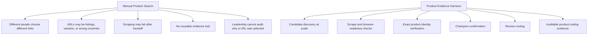
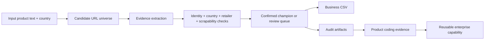
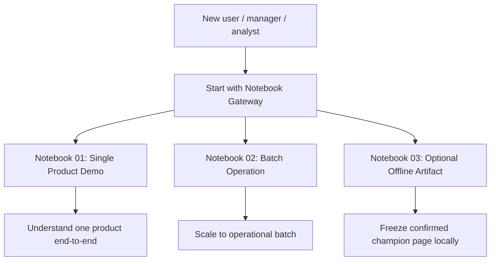
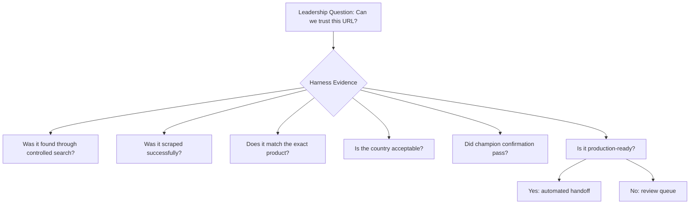

# Business Overview: Product Evidence Harness

## Executive summary

The Product Evidence Harness converts unstable, manual product URL discovery into a structured, auditable, decision-ready evidence pipeline.

It is not a simple scraper and it is not a loose web-search script. It is a product evidence system that discovers candidate product URLs, validates them through multiple independent gates, confirms a production-ready champion URL, and writes artifacts that downstream teams can trust.

```text
Search result links are not enough.
The business needs verified, explainable, scrape-ready, product-coding-ready evidence.
```

## Business problem

Manual product URL discovery is usually slow, inconsistent, and hard to defend.



## What the harness delivers

| Business capability | What it means |
|---|---|
| Product URL discovery | Finds candidate URLs from search and evidence sources. |
| Candidate tournament | Evaluates many candidates without treating the first result as truth. |
| Scrapability validation | Confirms whether the page is actually usable by downstream scraping. |
| Exact-product identity check | Separates true product pages from variants, siblings, listing pages, and weak references. |
| Champion confirmation | Re-checks the selected champion before handoff. |
| Production URL gate | Converts technical evidence into business-safe handoff status. |
| Review queue | Routes uncertain cases instead of silently producing weak automation. |
| Product coding evidence | Creates structured artifacts for downstream product feature coding. |
| Optional offline artifact | Freezes a confirmed champion page into local HTML/assets only when required. |

## Business value chain



## Why this matters

| Without harness | With harness |
|---|---|
| Manual link picking | Evidence-backed champion selection |
| Search-result guessing | Multi-signal candidate verification |
| Hidden assumptions | Explicit decision contracts |
| Downstream scrape failures discovered late | Scrapability checked before handoff |
| Weak auditability | Row-level trace, markdown, JSON, and metrics |
| Difficult to standardize | Notebook-first repeatable workflow |

## Notebook-first operating model

The system is intentionally accessible through notebooks first.



## Management framing

This codebase should be positioned as:

```text
An enterprise product evidence harness that turns web uncertainty into structured, auditable, reusable product-coding evidence.
```

It is valuable because it provides:

1. **Speed**: reduces manual product URL discovery effort.
2. **Quality**: validates URL usability before handoff.
3. **Trust**: explains why a URL was selected or rejected.
4. **Scale**: supports batch execution and metrics.
5. **Governance**: produces review queues and audit artifacts.
6. **Reusability**: converts discovery into product-coding evidence.

## What leadership should see



## Standardization recommendation

Adopt the harness as the standard product URL evidence layer when the business needs:

```text
main_text + country_code -> verified product URL -> product coding evidence -> audit trail
```

The key rule is simple:

```text
Only confirmed, production-ready champion URLs should be used for automated downstream handoff.
Everything else should move to review.
```
