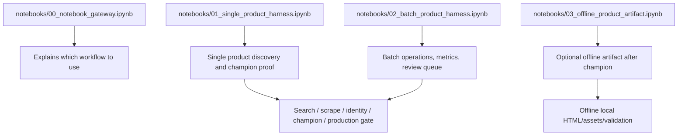
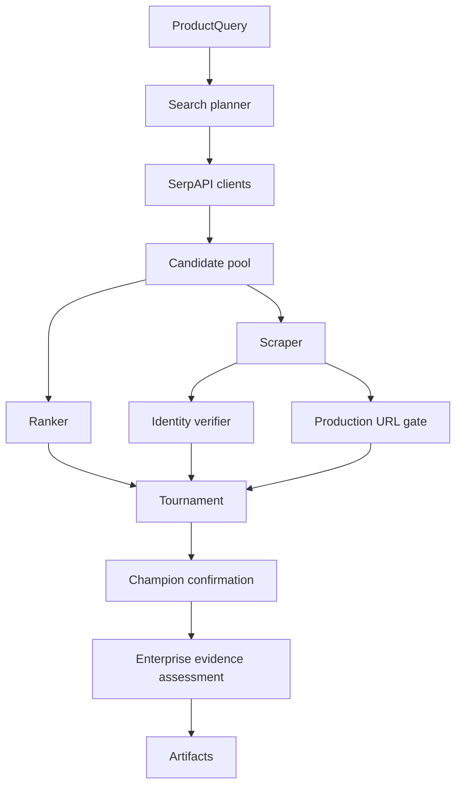

# Codebase Functionality Map

This document maps codebase functionality to business capability and notebook usage. It is written for adoption: users should understand what each part of the codebase enables without starting from implementation details.

## Business capability map

| Business capability | What it does | Primary code area | Notebook where witnessed |
|---|---|---|---|
| Input normalization | Converts product row fields into a stable product query. | `contracts.py`, `io.py` | `00`, `01`, `02` |
| Search planning | Creates query variants from main text, country, EAN, and retailer. | `llm/search_planner.py`, `serp_clients.py` | `01`, `02` |
| Candidate discovery | Collects candidate URLs from organic and AI-mode search evidence. | `serp_clients.py`, `tournament.py` | `01`, `02` |
| Preflight ranking | Scores many URLs before expensive scraping. | `ranker.py`, `tournament.py` | `01`, `02` |
| Tournament scraping | Scrapes bounded candidate batches to find stronger evidence. | `scraper.py`, `tournament.py` | `01`, `02` |
| Identity verification | Checks title, EAN, quantity, brand, variants, and product-page fit. | `identity_verifier.py`, `identity/`, `detectors/` | `01`, `02` |
| Production URL gate | Converts technical checks into business handoff readiness. | `production_url.py` | `01`, `02` |
| Champion confirmation | Confirms selected champion before handoff. | `tournament.py` | `01`, `02` |
| Enterprise evidence assessment | Adds quality tiers, coding readiness, and failure taxonomy. | `elite.py` | `01`, `02` |
| Artifact writing | Writes CSV/JSON/Markdown evidence trail. | `io.py`, pipeline modules | `01`, `02` |
| Optional offline capture | Freezes confirmed champion page into local evidence. | `offline_capture.py` | `03` only |

## Notebook ownership view



## Non-linear engine view



## What leadership should understand

```text
The codebase is modular, but the business workflow is unified.
Each module contributes evidence to the same decision: can this URL be trusted for downstream product coding?
```

## What users should not do

```text
Do not bypass notebooks for normal usage.
Do not manually call internals before understanding the notebook path.
Do not use offline_capture.py directly as the business workflow.
Do not treat search candidates as final outputs.
```

## Correct adoption path


