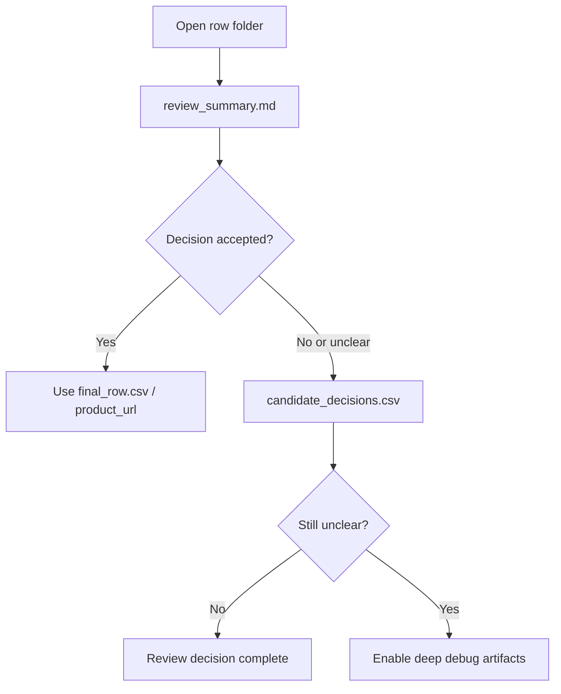

# Concise Review Artifacts

## Purpose

The default row artifact packet is now reviewer-first. The goal is to make review fast, precise, and decision-oriented.

The system still preserves deep debug capability when explicitly enabled, but the default output should not distract reviewers with many files.

```text
Default = concise review packet
Debug = opt-in detailed traces
```

## Default row folder

```text
output/<row_id>/
├── final_row.csv
├── review_summary.md
├── review_decision.json
├── candidate_decisions.csv
└── product_coding_input.json
```

## What each file is for

| File | Reviewer purpose | Open first? |
|---|---|---:|
| `review_summary.md` | Human-readable what/why/how decision summary. | Yes |
| `candidate_decisions.csv` | Top candidate selected/rejected table. | Yes |
| `final_row.csv` | One-row operational output. | Sometimes |
| `review_decision.json` | Machine-readable compact decision summary. | No, unless notebook/UI needs it |
| `product_coding_input.json` | Downstream coding evidence. | No, unless coding/debugging |

## Review workflow



## What review_summary.md answers

```text
What was selected?
Why was it selected?
How was the decision made?
What did the AI/model component decide or not decide?
What evidence supports the selected URL?
What was rejected and why?
Is this row safe for automated handoff or review-only?
```

## What candidate_decisions.csv answers

| Column | Meaning |
|---|---|
| `rank` | Candidate rank in the review set. |
| `selected` | Whether this candidate was selected. |
| `decision` | `SELECTED` or `REJECTED_OR_NOT_PROMOTED`. |
| `url` | Candidate URL. |
| `confidence` | Final candidate confidence. |
| `validation_status` | Candidate validation state. |
| `identity_status` | Product identity judgement. |
| `exact_product_check` | Whether the candidate appears to be the exact product. |
| `country_check` | Country alignment. |
| `retailer_check` | Retailer alignment. |
| `scrapable` | Whether scrape evidence was usable. |
| `reason` | Short reason for selection/rejection. |

## Deep debug artifacts

Verbose files are now opt-in:

```env
PRODUCT_HARNESS_WRITE_MARKDOWN_REPORTS=true
PRODUCT_HARNESS_WRITE_TRACE_JSON=true
PRODUCT_HARNESS_WRITE_DEBUG_CSVS=true
```

Use them only when:

```text
review_summary.md is insufficient
engineering needs execution trace
candidate scoring needs debugging
scrape behavior needs investigation
```

## Reviewer rule

```text
A reviewer should be able to judge most rows from review_summary.md and candidate_decisions.csv only.
```
