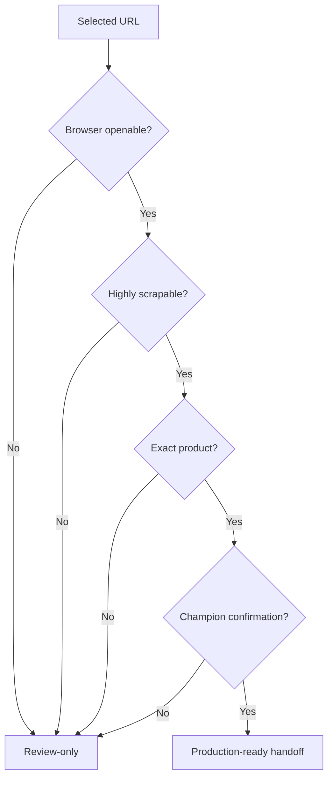
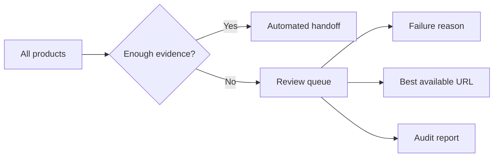

# Decision Contracts

This document defines the business meaning of the major output fields and status values. It is intended for managers, analysts, downstream scraping teams, and product-coding teams.

## Core principle

```text
A URL is not production-ready because it exists.
A URL is production-ready only when it passes the production URL gate and champion confirmation.
```

## Main URL fields

| Field | Business meaning | Automation interpretation |
|---|---|---|
| `product_url` | Selected URL emitted by the harness. | Use only when production gates pass. |
| `verified_exact_url` | Strict exact URL when exact product proof is strong. | Strongest URL evidence. |
| `best_available_url` | Best review candidate when no confirmed champion exists. | Review-only, not automated handoff. |
| `best_reference_url` | Useful supporting/reference URL. | Evidence only. |

## Handoff fields

| Field | Good value | Meaning |
|---|---|---|
| `production_url_ready` | `true` | URL is safe for browser/scraping/product-coding handoff. |
| `production_url_status` | `PRODUCTION_READY_EXACT_SCRAPABLE_BROWSER_URL` | Final production-readiness class. |
| `needs_review` | `false` | No manual review needed before automated handoff. |
| `browser_openable` | `true` | URL is expected to open in a normal browser. |
| `highly_scrapable` | `true` | Page has enough evidence and is scrape-usable. |
| `exact_product_url_match` | `true` | URL matches the intended product, not a sibling/variant. |
| `champion_confirmation.passed` | `true` | Repeated champion confirmation passed. |

## Production decision matrix

| Condition | Business decision |
|---|---|
| `production_url_ready=true` and `needs_review=false` and `champion_confirmation.passed=true` | Automated handoff allowed. |
| `production_url_ready=false` | Review-only. |
| `needs_review=true` | Review-only. |
| `champion_confirmation.passed=false` | Review-only. |
| `best_available_url` exists but `product_url` is not production-ready | Useful for reviewer, not automated handoff. |

## Visual gate contract



## Identity fields

| Field | Meaning |
|---|---|
| `identity_status` | Overall identity judgement for the selected candidate. |
| `ean_check` | Whether input EAN/GTIN matches page evidence. |
| `title_check` | Strength of product title match. |
| `quantity_check` | Whether pack count/quantity appears consistent. |
| `brand_check` | Whether brand evidence is aligned. |
| `variant_check` | Whether the page appears to be a conflicting variant. |
| `blocking_reasons` | Hard reasons preventing production handoff. |

## Retailer and country fields

| Field | Meaning |
|---|---|
| `retailer_check` | Whether the URL aligns with requested retailer evidence. |
| `country_check` | Whether URL/page is acceptable for the requested country policy. |
| `selected_domain` | Domain selected by the final decision. |
| `selected_retailer_name` | Retailer inferred/selected from evidence. |
| `selected_from_requested_retailer` | Whether selected URL came from the requested retailer. |
| `selected_from_global_fallback` | Whether a fallback/global candidate was used. |

## Quality fields

| Field | Meaning |
|---|---|
| `confidence` | Overall confidence in selected decision. |
| `quality_tier` | Enterprise quality tier, usually A/B/C/D/E. |
| `failure_taxonomy` | Machine-readable reasons for weak or review outcomes. |
| `coding_readiness_status` | Whether downstream product coding can consume the evidence. |

## Important statuses

| Status | Business meaning |
|---|---|
| `PRODUCTION_READY_EXACT_SCRAPABLE_BROWSER_URL` | Strongest automated handoff class. |
| `CHAMPION_CONFIRMATION_PASSED` | Repeated champion checks passed. |
| `CHAMPION_CONFIRMATION_FAILED` | Candidate was not stable/strong enough after confirmation. |
| `PRODUCT_URL_NOT_BROWSER_OPENABLE_NEEDS_REVIEW` | URL may exist but is not browser-safe. |
| `PRODUCT_URL_NOT_HIGHLY_SCRAPABLE_NEEDS_REVIEW` | Page is not rich/scrape-ready enough. |
| `PRODUCT_URL_NOT_EXACT_MATCH_NEEDS_REVIEW` | URL likely wrong product, variant, or sibling. |
| `PRODUCT_URL_GLOBAL_OR_COUNTRY_MISMATCH_NEEDS_REVIEW` | Country/fallback policy concern. |
| `STRICT_PRODUCT_URL_REQUIRED_BUT_NO_URL_CANDIDATE_AVAILABLE` | No viable candidate was discovered. |

## Review queue philosophy

The review queue is a strength, not a weakness.



A mature automation system must know when not to automate.
