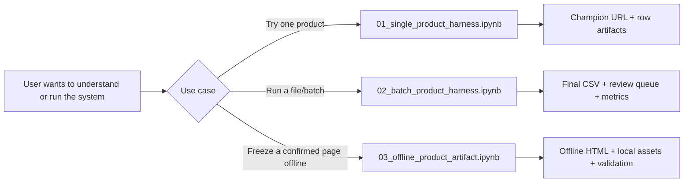
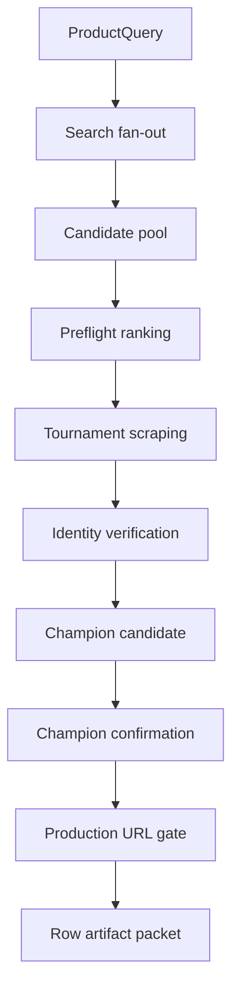
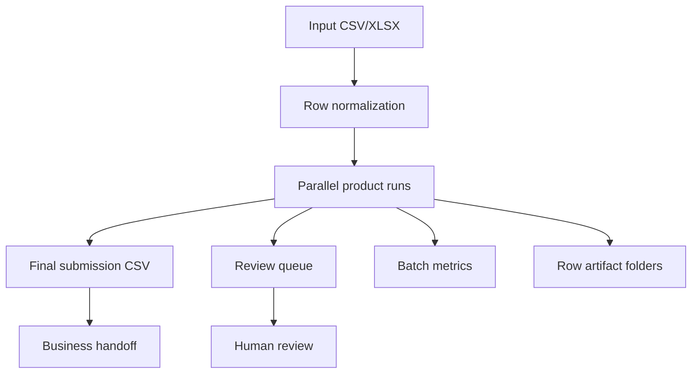
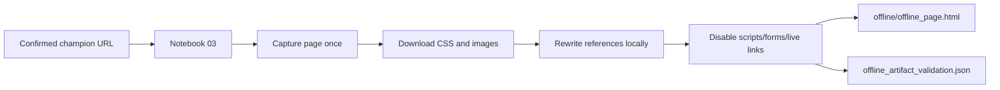

# Notebook Gateway

## Start here

The notebooks are the official gateway into the system. Users should not start by reading Python files.

```text
Notebook first -> evidence artifacts -> decision contracts -> codebase internals only when needed
```



## Notebook map

| Notebook | Primary user | Business purpose | What it proves | Key outputs |
|---|---|---|---|---|
| `notebooks/00_notebook_gateway.ipynb` | Everyone | Landing page and guided route | Which notebook to use and why | Notebook decision map |
| `notebooks/01_single_product_harness.ipynb` | Analyst, manager, demo user | End-to-end single product proof | Search, tournament, champion, production gate | `product_url`, champion confirmation, row artifact folder |
| `notebooks/02_batch_product_harness.ipynb` | Operations, delivery team | Scale the process over many rows | Batch-ready output and review queue | `final_submission.csv`, `review_queue.csv`, `metrics.json` |
| `notebooks/03_offline_product_artifact.ipynb` | Audit/evidence user | Optional offline capture after champion confirmation | Live page can be frozen locally | `offline/offline_page.html`, local assets, validation JSON |

## Notebook 01: single product harness

Use this when you want to show the full system capability with one product.



Best for:

```text
leadership demo
single product debugging
explaining why one URL won
showing row-level evidence artifacts
```

## Notebook 02: batch product harness

Use this when the business wants scale.



Best for:

```text
batch operations
manager reporting
coverage/quality metrics
review queue generation
```

## Notebook 03: optional offline product artifact

Use this only after a champion URL has already been confirmed. It is not a discovery notebook.



Best for:

```text
offline review
stable evidence preservation
manual audit
network-independent product evidence
```

## How to choose

| Question | Use |
|---|---|
| I want to understand the system quickly. | `00_notebook_gateway.ipynb` |
| I want to prove the system on one product. | `01_single_product_harness.ipynb` |
| I want to run many rows. | `02_batch_product_harness.ipynb` |
| I already have a confirmed champion URL and need a frozen local page. | `03_offline_product_artifact.ipynb` |

## What not to do

```text
Do not start with src/ internals.
Do not use Notebook 03 for discovery.
Do not treat review-only URLs as production-ready.
Do not bypass champion confirmation for automated handoff.
Do not confuse best_available_url with product_url.
```

## Business gateway message

The notebook experience should communicate this clearly:

```text
The system is easy to try, but the decisions are enterprise-grade.
```
