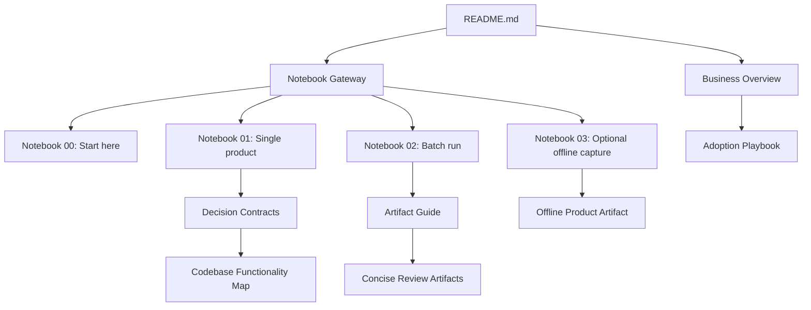
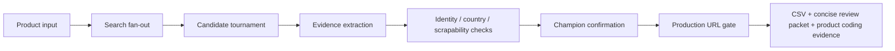

# Documentation Index

This documentation is organized for adoption. Start with the business story, then use notebooks as the execution gateway, then inspect decision contracts and concise review artifacts.



## Start here

| Document | Purpose | Primary audience |
|---|---|---|
| `../README.md` | Root business + technical entrypoint. | Everyone |
| `BUSINESS_OVERVIEW.md` | Leadership-facing value explanation. | Leadership, managers |
| `NOTEBOOK_GATEWAY.md` | Notebook-first usage map. | Everyone |
| `VISUAL_PIPELINE_GUIDE.md` | Graphical explanation of the non-linear pipeline. | Managers, engineers, reviewers |
| `CODEBASE_FUNCTIONALITY_MAP.md` | Business capability map from code modules to notebook workflows. | Managers, engineers, adoption leads |
| `DECISION_CONTRACTS.md` | Output field/status meaning and handoff rules. | Operations, downstream teams |
| `ARTIFACT_GUIDE.md` | Output files, audit trail, and row artifact interpretation. | Analysts, reviewers, engineers |
| `CONCISE_REVIEW_ARTIFACTS.md` | Reviewer-first artifact packet: what, why, how, selected/rejected. | Reviewers, managers, notebook users |
| `ASSUMPTIONS_AND_CONSTRAINTS.md` | Input assumptions, external limits, and reliability boundaries. | Leadership, governance, engineers |
| `ADOPTION_PLAYBOOK.md` | Demo, rollout, and standardization playbook. | Managers, champions, delivery leads |
| `OFFLINE_PRODUCT_ARTIFACT.md` | Optional notebook-only offline capture contract. | Audit/evidence users |

## Notebook-first gateway

| Notebook | Purpose | Linked docs |
|---|---|---|
| `../notebooks/00_notebook_gateway.ipynb` | Start here; decide the right notebook path. | `NOTEBOOK_GATEWAY.md`, `BUSINESS_OVERVIEW.md` |
| `../notebooks/01_single_product_harness.ipynb` | Demonstrate one product end-to-end and inspect concise review artifacts. | `VISUAL_PIPELINE_GUIDE.md`, `DECISION_CONTRACTS.md`, `CONCISE_REVIEW_ARTIFACTS.md` |
| `../notebooks/02_batch_product_harness.ipynb` | Run many products and produce business outputs. | `ARTIFACT_GUIDE.md`, `DECISION_CONTRACTS.md`, `ADOPTION_PLAYBOOK.md` |
| `../notebooks/03_offline_product_artifact.ipynb` | Optional offline page capture after champion confirmation. | `OFFLINE_PRODUCT_ARTIFACT.md`, `ASSUMPTIONS_AND_CONSTRAINTS.md` |

## Primary architecture



## Production handoff rule

For browser-opening, downstream scraping, and product-coding teams, use only rows where:

```text
production_url_ready = true
production_url_status = PRODUCTION_READY_EXACT_SCRAPABLE_BROWSER_URL
champion_confirmation.passed = true
champion_confirmation.success_count = champion_confirmation.required_successes
needs_review = false
```

Rows outside this filter can still contain useful evidence, but they are review-only.

## Default review packet

```text
output/<row_id>/
├── final_row.csv
├── review_summary.md
├── review_decision.json
├── candidate_decisions.csv
└── product_coding_input.json
```

Open `review_summary.md` first. It is designed to answer what was selected, why, how it was decided, what the model/detectors contributed, what was rejected, and what a reviewer should do next.

## Optional offline handoff rule

Offline artifact capture is an optional second-stage notebook workflow, not part of the default discovery/tournament run.

```text
confirmed champion URL
  → notebooks/03_offline_product_artifact.ipynb
  → PRODUCTION_READY_OFFLINE_ARTIFACT
  → offline/offline_page.html
```

The live URL remains provenance. The offline artifact becomes the local evidence package only for workflows that explicitly opt into this step.
