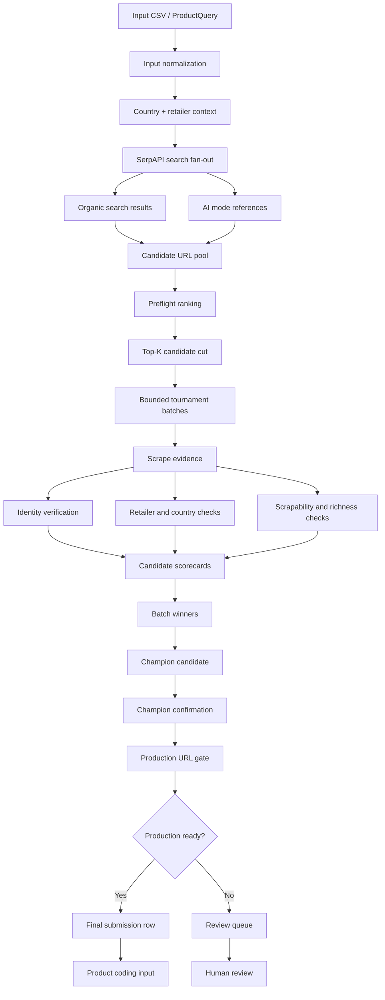
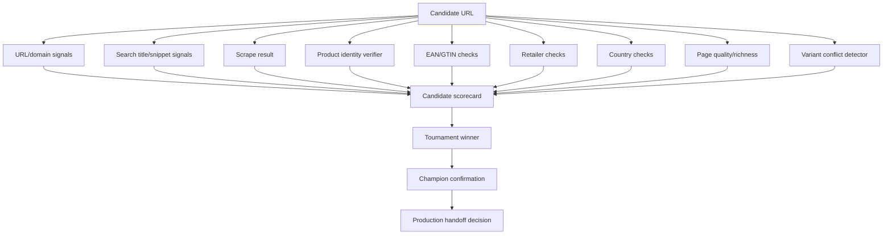
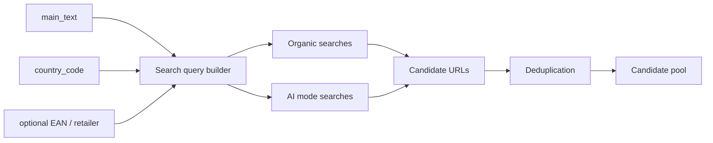
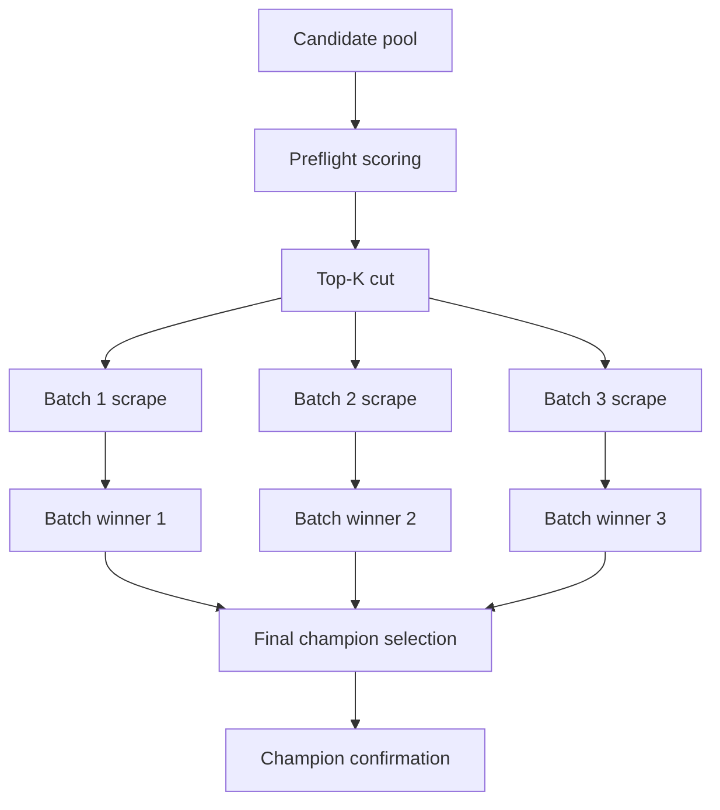
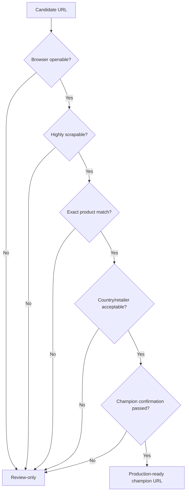
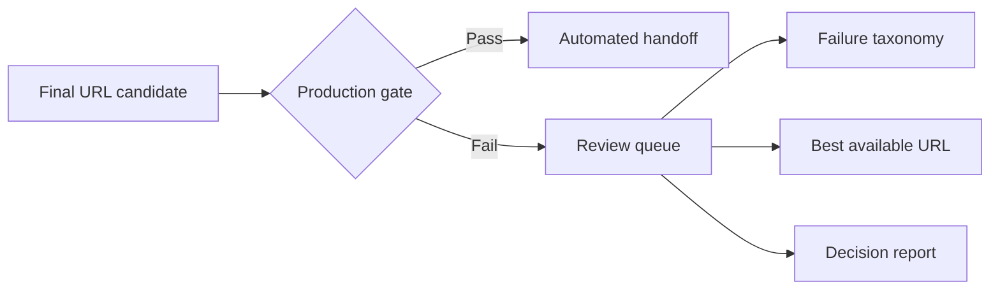
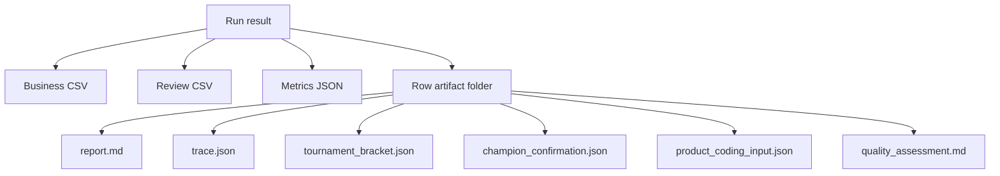
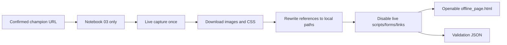

# Visual Pipeline Guide

This document explains the non-linear product evidence pipeline visually. The harness should be understood as a decision system, not as a single scraper.

## Full pipeline at a glance



## Why this is non-linear

Many independent tools contribute evidence to a single decision. The winning URL is not selected by search rank alone.



## Search and candidate discovery



## Tournament mode

Tournament mode makes the system faster and stronger than naive sequential scraping.



## Decision gates

A URL cannot become production-ready by being merely reachable. It must pass multiple gates.



## Review routing

The harness is designed to avoid false confidence. Weak cases are routed to review instead of being silently automated.



## Artifact creation



## Optional offline capture

Offline capture is separate and notebook-only from a user workflow perspective. It starts after champion confirmation, not before.



## System mental model

```text
Search finds possibilities.
Scraping extracts evidence.
Identity verification protects exactness.
Tournament mode selects the strongest candidate.
Champion confirmation protects handoff quality.
Artifacts make the decision auditable.
Notebooks make the system usable.
```
